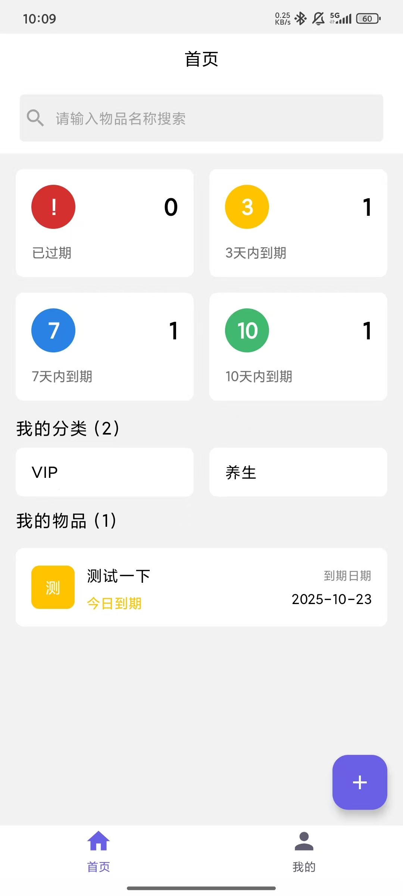
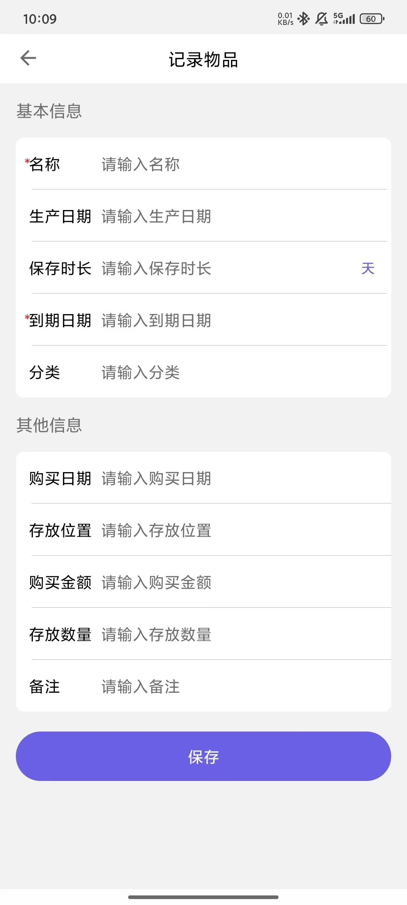

# 物品管理

物品记是一款使用Jetpack Compose开发的单Activity的小工具。所有记录都保存在手机本地。欢迎大家使用。

## 主要功能

- 📝 物品信息记录（名称、过期时间、分类等）
- 🏷️ 自定义分类管理
- ⏰ 过期时间自动追踪和提醒
- 🔍 快速搜索和筛选功能
- 📊 物品状态概览

## 技术栈

- **Kotlin** - 开发语言
- **Jetpack Compose** - 现代化 UI
- **Room** - 本地数据库

## 项目环境

- Android Studio 2024.1
- JDK 11 或更高版本

## 快速开始

1. 克隆项目到本地
2. 使用 Android Studio 打开项目
3. 等待 Gradle 同步完成
4. 连接设备或启动模拟器
5. 运行应用

## 应用截图
 
## 许可证

本项目采用 MIT 许可证。